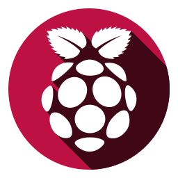
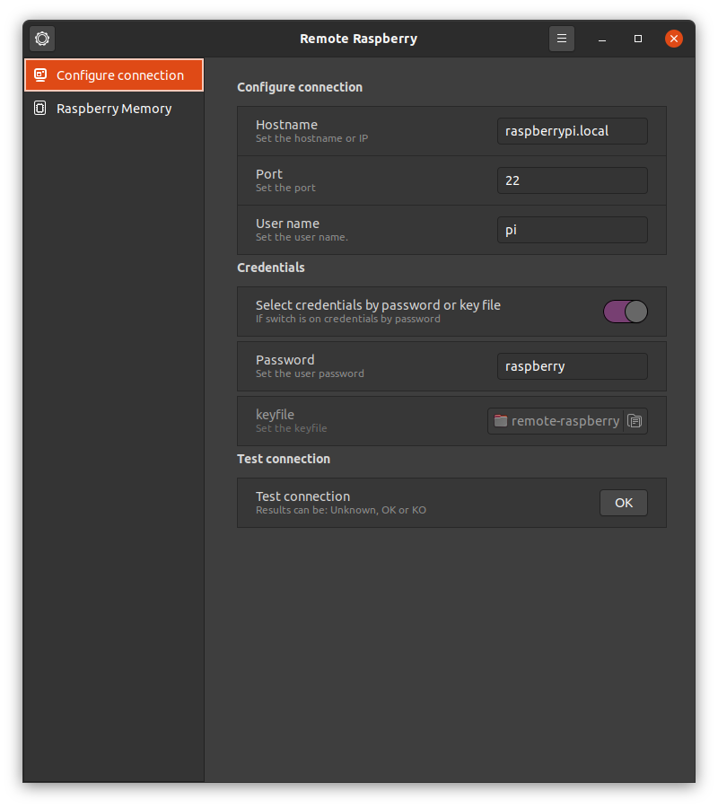
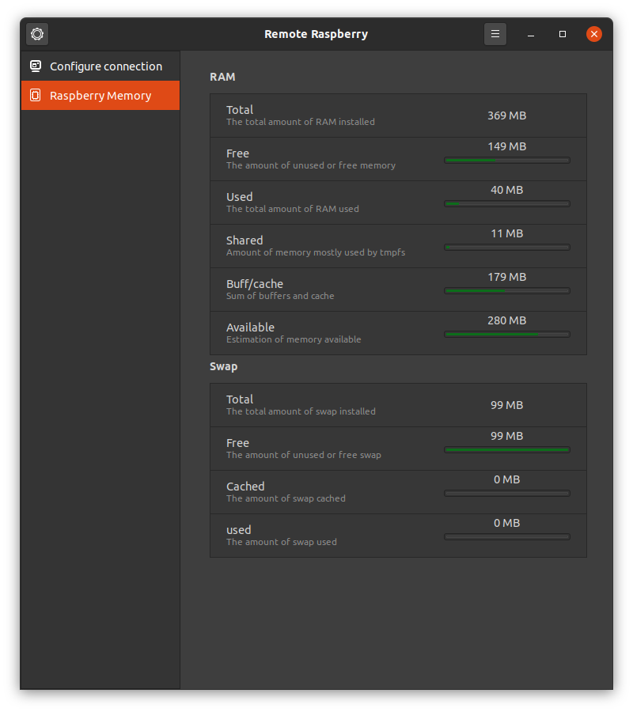

<!-- start project-info -->
<!--
project_title: Remote Raspberry
github_project: https://github.com/atareao/remote-raspberry
license: MIT
icon: /datos/Sync/Programacion/Python/remote-raspberry/data/icons/scalable/apps/remote-raspberry.svg
homepage: https://www.atareao.es/aplicacion/remote-raspberry
license-badge: True
contributors-badge: True
lastcommit-badge: True
codefactor-badge: True
--->

<!-- end project-info -->

<!-- start badges -->


[](https://www.codefactor.io/repository/github/atareao/remote-raspberry/overview/master)
<!-- end badges -->

<!-- start description -->
<h1 align="center">Welcome to <span id="project_title">Remote Raspberry</span> 👋</h1>
<p>
<a href="https://www.atareao.es/aplicacion/remote-raspberry" id="homepage" rel="nofollow">

</a>
</p>
<h2>🏠 <a href="https://www.atareao.es/aplicacion/remote-raspberry" id="homepage">Homepage</a></h2>
<p><span id="project_title">Remote Raspberry</span> is an application to manage your Raspberry Pi remotely</p>

<!-- end description -->

<!-- start prerequisites -->
## Prerequisites

Before you begin, ensure you have met the following requirements:

* If you install it from PPA don't worry about, becouse all the requirements are included in the package
* If you clone the repository, you need, at least, these dependecies,

```
gir1.2-gtk-3.0
gir1.2-glib-2.0
gir1.2-gdkpixbuf-2.0
gir1.2-appindicator3-0.1
gir1.2-keybinder-3.0
```


<!-- end prerequisites -->

<!-- start installing -->
## Installing <span id="project_title">Remote Raspberry</span> from PPA

To install <span id="project_title">Remote Raspberry</span>, follow these steps:

* In a terminal (`Ctrl+Alt+T`), run these commands

```
sudo add-apt-repository ppa:atareao/atareao
sudo apt update
sudo apt install remote-raspberry
```


## Build it from source and install it after that

```sh
git clone https://github.com/atareao/remote-raspberry
cd remote-raspberry
rm ./debian/source/format
dpkg-buildpackage
cd ..
sudo dpkg -i remote-raspberry_*_all.deb
sudo apt-get install -f -y
```

<!-- end installing -->

<!-- start using -->
## Using <span id="project_title">Remote Raspberry</span>

When you start **<span id="project_title">Remote Raspberry</span>** you must provide information about your Raspberry SSH connection



In the Memory Tab you can get information about your remote Raspberry Pi RAM and SWAP usage.




<!-- end using -->

<!-- start contributing -->
## Contributing to <span id="project_title">Remote Raspberry</span>

To contribute to **<span id="project_title">Remote Raspberry</span>**, follow these steps:

1. Fork this repository.
2. Create a branch: `git checkout -b <branch_name>`.
3. Make your changes and commit them: `git commit -m '<commit_message>'`
4. Push to the original branch: `git push origin atareao/remote-raspberry`
5. Create the pull request.

Alternatively see the GitHub documentation on [creating a pull request](https://help.github.com/en/github/collaborating-with-issues-and-pull-requests/creating-a-pull-request).
</commit_message></branch_name>


<!-- end contributing -->

<!-- start contributors -->
## 👤 Contributors ✨

Thanks goes to these wonderful people ([emoji key](https://allcontributors.org/docs/en/emoji-key)):


<!-- end contributors -->

<!-- start table-contributors -->

<table id="contributors">
	<tr id="info_avatar">
		<td id="atareao" align="center">
			<a href="https://github.com/atareao">
				
			</a>
		</td>
		<td id="freddii" align="center">
			<a href="https://github.com/freddii">
				
			</a>
		</td>
		<td id="jmmanzano" align="center">
			<a href="https://github.com/jmmanzano">
				
			</a>
		</td>
	</tr>
	<tr id="info_name">
		<td id="atareao" align="center">
			<a href="https://github.com/atareao">
				<strong>Lorenzo Carbonell</strong>
			</a>
		</td>
		<td id="freddii" align="center">
			<a href="https://github.com/freddii">
				<strong>freddii</strong>
			</a>
		</td>
		<td id="jmmanzano" align="center">
			<a href="https://github.com/jmmanzano">
				<strong>jmmanzano</strong>
			</a>
		</td>
	</tr>
	<tr id="info_commit">
		<td id="atareao" align="center">
			<a href="/commits?author=atareao">
				<span id="role">💻</span>
			</a>
		</td>
		<td id="freddii" align="center">
			<a href="/commits?author=freddii">
				<span id="role">🌍</span>
			</a>
		</td>
		<td id="jmmanzano" align="center">
			<a href="/commits?author=jmmanzano">
				<span id="role">🐛</span>
			</a>
		</td>
	</tr>
</table>
<!-- end table-contributors -->
